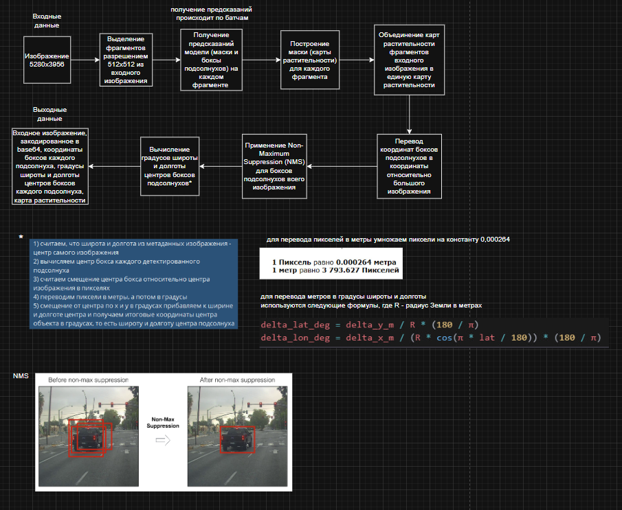

## Проект по построению карт растительности полей подсолнухов

## Пайплайн решения 



## Демонстрация работы 


## Запуск проекта

```sh

# build
docker compose up --build

# run
docker compose up
```